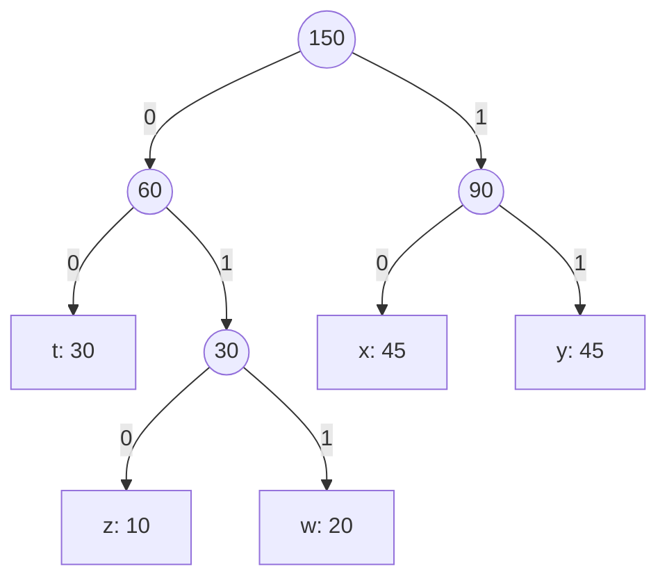

# 📝 Mock Final Exam — Generative AI (AI442)

**Course:** Generative Adversarial Networks (AI442)  
**Exam Duration:** 2 Hours  
**Total Marks:** 40 Marks  
**Coverage:** Word2Vec, Autoencoders, Huffman Coding, VAEs, GANs/CGANs, and Diffusion Models (PCA NOT included).

---

## 📋 Section I: Multiple Choice Questions (MCQs) [8 Marks]
*Choose the best answer for each of the following 8 questions. (1 Mark each)*

### 1. Sizing in Autoencoders
What is the missed layer size in the Autoencoder network structure `[100 - 40 - ? - 40 - 100]` to make it a valid compressed Autoencoder?
* a. 50
* b. 100
* c. 20
* d. 40

### 2. Decoder Layer Matching
What is the size of the final layer in the Autoencoder structure `[64 - 16 - 4 - 16 - ?]` to make it a reconstructive Autoencoder?
* a. 4
* b. 64
* c. 16
* d. any number less than 4

### 3. UpSampling Layer Parameters
How many learnable parameters (weights) are there in an `UpSampling2D` layer?
* a. Double the input size
* b. Same as the input size
* c. Zero
* d. Depends on the scale factor

### 4. Learned Spatial Upscaling
Which of the following layers is used to upscale an image using **learnable weights**?
* a. UpSampling2D
* b. MaxPooling2D
* c. Conv2DTranspose
* d. Dense

### 5. KL Divergence Properties
Which of the following statements is true regarding Kullback-Leibler (KL) Divergence?
* a. $D_{KL}(P \| Q) = D_{KL}(Q \| P)$ always
* b. $D_{KL}(P \| Q) < 0$ is possible for identical distributions
* c. $D_{KL}(P \| Q) \neq D_{KL}(Q \| P)$ in general
* d. $D_{KL}(P \| Q) = 1 / D_{KL}(Q \| P)$

### 6. Huffman Codes Prefix Property
If the set of generated codes for a message is `(01, 10, 00, 110, 111)`, which of the following is true?
* a. It is not prefix-free because 0 is a prefix of 01.
* b. It is prefix-free (valid prefix code).
* c. It is not prefix-free because 110 contains 10.
* d. It cannot represent a latent space.

### 7. GAN Detaching Gradients
When training the Discriminator in a GAN, we compute `D(fake_imgs.detach())`. Why do we call `.detach()`?
* a. To increase the resolution of the fake images.
* b. To speed up the Discriminator forward pass.
* c. To freeze the Generator's weights and prevent gradients from updating G during D's step.
* d. To save GPU memory by removing the fake images.

### 8. Diffusion Model Network Inputs
What are the inputs to the U-Net noise-predictor model at each step of the denoising (generation) process?
* a. The clean image and the timestep $t$
* b. The noisy image $x_t$ and the timestep $t$
* c. Only the noise vector $\epsilon$
* d. The original image $x_0$ and the final step $T$

---

## 📊 Section II: Tracing Questions [20 Marks]
*Provide detailed step-by-step calculations and diagrams.*

### Q1: Huffman Coding [5 Marks]
If you have a message to be encoded by the Huffman Algorithm:
The message contains: **45 letters of "x", 45 letters of "y", 10 letters of "z", 20 letters of "w", and 30 letters of "t"**.
* Build the Encoding Tree.
* Generate the Codes for each letter.

---

### Q2: Word2Vec Vector Math & Plotting [5 Marks]
Given the following word embeddings in 2D space:
| Word | Embedding Vector |
|---|---|
| coffee | `(0.45, 0.60)` |
| tea | `(0.38, 0.52)` |
| ice | `(-0.75, -0.40)` |
| milk | `(0.25, 0.12)` |
| cold | `(-0.60, -0.80)` |
| sugar | `(0.10, 0.35)` |
| mug | `(0.55, 0.18)` |

* **a)** Draw a sketch plotting these 7 words in 2D space. *[2 Marks]*
* **b)** In case we generate a new vector as $\text{newVec} = \mathbf{v}_{\text{ice}} + \mathbf{v}_{\text{cold}}$, calculate the coordinates of $\text{newVec}$. *[1 Mark]*
* **c)** Determine mathematically the nearest two words to the $\text{newVec}$. *[2 Marks]*

---

### Q3: KL Divergence step-by-step [10 Marks]
Calculate the KL-Divergences $D_{KL}(P \| Q)$ and $D_{KL}(Q \| P)$ for the following probability distributions over $x \in \{-1, -0.5, 0.5, 1\}$:
*(Hint: $\ln(y) = 2.303 \log_{10}(y)$)*

| $x$ | $-1$ | $-0.5$ | $0.5$ | $1$ |
|---|---|---|---|---|
| **$P(x)$** | $0.4$ | $0.2$ | $0.3$ | $0.1$ |
| **$Q(x)$** | $0.3$ | $0.3$ | $0.2$ | $0.2$ |

---

## 💻 Section III: Coding Questions [12 Marks]
*(Write your Python code iteratively. Standard imports like numpy as np are allowed).*

### Q1: Latent Space Walk with Variable Steps [5 Marks]
Assume you have a readymade AutoEncoder:
```python
Zs = encoder.predict(x_test)
decoded_imgs = decoder.predict(Zs)
```
Write a Python function `latent_walk_search(Zs, Targt, threshold)` that walks the latent space between each pair of latent vectors in `Zs`.
* For each pair of vectors $(Z_i, Z_k)$, try variable step sizes from **12 to 18 steps** (inclusive) using `np.linspace`.
* Decode the interpolated points and calculate the distance using a readymade function `Dist(Img1, Img2)`.
* If a decoded image has a distance $\leq \text{threshold}$, save it to a list and return the list when the search is complete.

---

### Q2: VAE Target Reconstruction with Mean Modification [7 Marks]
In a VAE system, your manager selects a target image `Trgt` from the training set:
* **a)** Write code to **flip horizontally** the `Trgt` image (assume it is a 2D array of shape 28x28). *[2 Marks]*
* **b)** Modify the training means ($\mu$) array `all_mus` (shape: `num_samples, latent_dim`) such that:
  * All negative values of $\mu$ are replaced by `0.0`.
  * All positive values of $\mu$ are scaled by `0.5`. *[2 Marks]*
* **c)** Write a search loop that iterates over the training set, retrieves the mean and log-variance from the encoder, applies the modifications from Part (b), samples a latent vector $z$ using the reparameterization trick with random noise (repeat **3 times** per image), decodes $z$, and calculates the distance to the flipped target. Return the index $i$ of the best matching image and the random noise vector that produced it. *[3 Marks]*

---
---

# 🔑 Mock Exam Model Answers & Explanations

Here are the detailed model answers for the mock final exam. Each answer contains step-by-step mathematical tracing, verified code implementations, and clear English and Arabic explanations.

---

## 📂 Section I: MCQ Answers & Explanations

### 1. **c. 20**
* **English Explanation**: An Autoencoder compresses data to a latent space (the bottleneck). For the layout to represent compression, the bottleneck layer must be smaller than the layers around it. The layers around it have size 40, so the bottleneck size `?` must be less than 40. The only choice less than 40 is 20.
* **بالعربي**: الأوتو إنكودر بيضغط البيانات في النص (البوتلنك). عشان كدا لازم الطبقة اللي في النص تكون أصغر من اللي حواليها. الطبقات اللي حواليها حجمها 40، يبقى حجم طبقة البوتلنك لازم يكون أقل من 40. الاختيار الوحيد هو 20.

### 2. **b. 64**
* **English Explanation**: The goal of an Autoencoder is to reconstruct the input. The size of the output layer must exactly match the size of the input layer. The input layer has size 64, so the final output layer `?` must also be 64.
* **بالعربي**: الهدف من الأوتو إنكودر هو إعادة بناء المدخلات. عشان كدا لازم الطبقة الأخيرة (المخرجات) يكون حجمها مساوي تماماً للطبقة الأولى (المدخلات) اللي هي 64.

### 3. **c. Zero**
* **English Explanation**: `UpSampling2D` is a non-learnable layer. It increases the spatial size of an image simply by repeating pixels or using bilinear interpolation. It has no weights to train.
* **بالعربي**: طبقة الـ `UpSampling2D` مفيهاش أي معاملات بتتدرب (صفر معاملات). هي بس بتكرر البكسلات عشان تكبر الصورة من غير تعلم.

### 4. **c. Conv2DTranspose**
* **English Explanation**: `Conv2DTranspose` (often called deconvolution) performs upscaling using learnable filters/parameters, allowing the model to learn how to upscale images cleanly.
* **بالعربي**: الـ `Conv2DTranspose` هي الطبقة اللي بتكبر حجم الصورة بذكاء عن طريق فلاتر بتتعلم (ليها أوزان بتتدرب).

### 5. **c. $D_{KL}(P \| Q) \neq D_{KL}(Q \| P)$ in general**
* **English Explanation**: KL Divergence is asymmetric, meaning the order of arguments matters. It is a measure of divergence, not a true metric distance.
* **بالعربي**: الـ KL Divergence مش متماثلة. يعني الترتيب بيفرق: حساب الفرق بين P و Q مش بيساوي الفرق بين Q و P.

### 6. **b. It is prefix-free (valid prefix code).**
* **English Explanation**: A prefix code is prefix-free if no codeword is a prefix of any other codeword. In the set `(01, 10, 00, 110, 111)`:
  * `01` is not a prefix of any other.
  * `10` is not a prefix.
  * `00` is not a prefix.
  * `110` and `111` do not start with any other codes. None is a prefix of another, so it is a valid prefix code.
* **بالعربي**: كود هافمان بيكون صالح لو مفيش أي كود عبارة عن بداية لكود تاني (prefix-free). في المجموعة دي، مفيش أي كود بيبدأ بكود تاني بالكامل، عشان كدا الكود صالح.

### 7. **c. To freeze the Generator's weights and prevent gradients from updating G during D's step.**
* **English Explanation**: Calling `.detach()` cuts the gradients in the computation graph. During the Discriminator's training step, we feed D fake images but we only want to update D's weights, not G's. Detaching the fake images blocks gradients from flowing back to G.
* **بالعربي**: دالة `.detach()` بتقطع الـ gradients في الرسم البياني للحسابات. لما بندرب الـ Discriminator مش عايزين نغير أوزان الـ Generator. كدا بنمنع الـ gradients ترجع للمولد.

### 8. **b. The noisy image $x_t$ and the timestep $t$**
* **English Explanation**: The Diffusion U-Net model must predict how much noise was added. To do this, it needs the noisy image $x_t$ and the timestep $t$ (which acts as a noise-level indicator).
* **بالعربي**: شبكة الـ U-Net في الـ Diffusion بتحتاج الصورة المتشوشة $x_t$ ورقم الخطوة الزمنية $t$ (اللي بيعبر عن مستوى التشويش) عشان تعرف تتوقع التشويش.

---

## 📂 Section II: Tracing Answers & Explanations

### Q1: Huffman Coding
**Frequencies:** `z: 10`, `w: 20`, `t: 30`, `x: 45`, `y: 45`. Total = 150.

**Step-by-Step Construction:**
1. **Combine `z` (10) and `w` (20)** → Node `(zw)` with frequency 30.
   * Remaining nodes: `t` (30), `(zw)` (30), `x` (45), `y` (45).
2. **Combine `t` (30) and `(zw)` (30)** → Node `(tzw)` with frequency 60.
   * Remaining nodes: `x` (45), `y` (45), `(tzw)` (60).
3. **Combine `x` (45) and `y` (45)** → Node `(xy)` with frequency 90.
   * Remaining nodes: `(tzw)` (60), `(xy)` (90).
4. **Combine `(tzw)` (60) and `(xy)` (90)** → Root with frequency 150.

**Huffman Encoding Tree (Left = 0, Right = 1):**


**Resulting Codes:**
* **`t`**: `00` (length 2)
* **`z`**: `010` (length 3)
* **`w`**: `011` (length 3)
* **`x`**: `10` (length 2)
* **`y`**: `11` (length 2)

---

### Q2: Word2Vec Vector Math & Plotting
* **a) Plot Sketch**: Place the points in a 2D Cartesian grid. Points `coffee, tea, milk, sugar, mug` lie in Quadrant I (both coordinates positive). Points `ice, cold` lie in Quadrant III (both coordinates negative).

* **b) Vector Addition**:
  $$\text{newVec} = \mathbf{v}_{\text{ice}} + \mathbf{v}_{\text{cold}}$$
  $$\text{newVec} = (-0.75, -0.40) + (-0.60, -0.80) = (-0.75 - 0.60, -0.40 - 0.80) = \mathbf{(-1.35, -1.20)}$$

* **c) Nearest Words Search**:
  Compute Euclidean distance squared ($d^2 = \Delta x^2 + \Delta y^2$) between `newVec` $(-1.35, -1.20)$ and Quadrant III words:
  * **Distance to `cold`** `(-0.60, -0.80)`:
    $$d^2 = (-0.60 - (-1.35))^2 + (-0.80 - (-1.20))^2 = (0.75)^2 + (0.40)^2 = 0.5625 + 0.1600 = 0.7225 \implies d = 0.85$$
  * **Distance to `ice`** `(-0.75, -0.40)`:
    $$d^2 = (-0.75 - (-1.35))^2 + (-0.40 - (-1.20))^2 = (0.60)^2 + (0.80)^2 = 0.36 + 0.64 = 1.0000 \implies d = 1.00$$
  
  All other words lie in Quadrant I (positive coordinates) and are extremely far ($d \gg 2.0$).
  * **Answer**: The two nearest words to `newVec` are **`cold`** (distance 0.85) and **`ice`** (distance 1.00).

---

### Q3: KL Divergence step-by-step
**Given Data:**
* $P = [0.4, 0.2, 0.3, 0.1]$
* $Q = [0.3, 0.3, 0.2, 0.2]$

#### **Part A: Calculating $D_{KL}(P \| Q)$**
$$D_{KL}(P \| Q) = \sum_{x} P(x) \ln\left(\frac{P(x)}{Q(x)}\right)$$
1. **$x = -1$:**
   $$\text{Term}_1 = 0.4 \ln\left(\frac{0.4}{0.3}\right) = 0.4 \ln(1.3333) \approx 0.4 \times 2.303 \log_{10}(1.3333)$$
   $$\approx 0.9212 \times 0.1249 \approx 0.1151$$
2. **$x = -0.5$:**
   $$\text{Term}_2 = 0.2 \ln\left(\frac{0.2}{0.3}\right) = 0.2 \ln(0.6667) \approx 0.2 \times 2.303 \log_{10}(0.6667)$$
   $$\approx 0.4606 \times (-0.1761) \approx -0.0811$$
3. **$x = 0.5$:**
   $$\text{Term}_3 = 0.3 \ln\left(\frac{0.3}{0.2}\right) = 0.3 \ln(1.5) \approx 0.3 \times 2.303 \log_{10}(1.5)$$
   $$\approx 0.6909 \times 0.1761 \approx 0.1217$$
4. **$x = 1$:**
   $$\text{Term}_4 = 0.1 \ln\left(\frac{0.1}{0.2}\right) = 0.1 \ln(0.5) \approx 0.1 \times 2.303 \log_{10}(0.5)$$
   $$\approx 0.2303 \times (-0.3010) \approx -0.0693$$

**Sum:**
$$D_{KL}(P \| Q) = 0.1151 - 0.0811 + 0.1217 - 0.0693 = \mathbf{0.0864}$$

---

#### **Part B: Calculating $D_{KL}(Q \| P)$**
$$D_{KL}(Q \| P) = \sum_{x} Q(x) \ln\left(\frac{Q(x)}{P(x)}\right)$$
1. **$x = -1$:**
   $$\text{Term}_1 = 0.3 \ln\left(\frac{0.3}{0.4}\right) = 0.3 \ln(0.75) \approx 0.3 \times 2.303 \log_{10}(0.75)$$
   $$\approx 0.6909 \times (-0.1249) \approx -0.0863$$
2. **$x = -0.5$:**
   $$\text{Term}_2 = 0.3 \ln\left(\frac{0.3}{0.2}\right) = 0.3 \ln(1.5) \approx 0.3 \times 2.303 \log_{10}(1.5)$$
   $$\approx 0.6909 \times 0.1761 \approx 0.1217$$
3. **$x = 0.5$:**
   $$\text{Term}_3 = 0.2 \ln\left(\frac{0.2}{0.3}\right) = 0.2 \ln(0.6667) \approx 0.2 \times 2.303 \log_{10}(0.6667)$$
   $$\approx 0.4606 \times (-0.1761) \approx -0.0811$$
4. **$x = 1$:**
   $$\text{Term}_4 = 0.2 \ln\left(\frac{0.2}{0.1}\right) = 0.2 \ln(2) \approx 0.2 \times 2.303 \log_{10}(2)$$
   $$\approx 0.4606 \times 0.3010 \approx 0.1386$$

**Sum:**
$$D_{KL}(Q \| P) = -0.0863 + 0.1217 - 0.0811 + 0.1386 = \mathbf{0.0929}$$

---

## 📂 Section III: Coding Answers

### Q1: Latent Space Walk with Variable Steps
```python
import numpy as np

def latent_walk_search(Zs, Targt, threshold):
    those = []
    num_samples = len(Zs)
    
    # 1. Iterate over all unique pairs of latent vectors
    for i in range(num_samples):
        for k in range(i + 1, num_samples):
            
            # 2. Variable step sizes from 12 to 18 (inclusive)
            for steps in range(12, 19):
                # Interpolate between Z_i and Z_k
                interpolated = np.linspace(Zs[i], Zs[k], steps)
                
                # 3. Decode all interpolated steps at once
                decoded_imgs = decoder.predict(interpolated)
                
                # 4. Check distance to target
                for a in range(steps):
                    img = decoded_imgs[a]
                    if Dist(img, Targt) <= threshold:
                        those.append(img)
                        break  # Found match for this pair, move to next pair
                        
    return those
```

---

### Q2: VAE Target Reconstruction with Mean Modification
```python
import numpy as np

# ================= Part a =================
# Flip the target image horizontally
# (axis=1 flips horizontally, axis=0 flips vertically)
flipped_target = np.flip(Trgt.reshape(28, 28), axis=1)
target_flat = flipped_target.flatten()

# ================= Part b =================
# Modify all means (all_mus) in-place or on a copy
modified_mus = all_mus.copy()
# Negative values replaced by 0.0
modified_mus[modified_mus < 0] = 0.0
# Positive values scaled by 0.5
modified_mus[modified_mus > 0] = modified_mus[modified_mus > 0] * 0.5

# ================= Part c =================
best_dist = float('inf')
best_i = -1
best_noise = None

for i in range(len(x_train)):
    # 1. Get the modified mean for image i
    mu_mod = modified_mus[i:i+1]
    
    # 2. Get the log-variance for image i from the encoder
    _, log_var_i = encoder.predict(x_train[i:i+1])
    sigma_i = np.exp(0.5 * log_var_i)
    
    # 3. Sample 3 times with different noise
    for _ in range(3):
        noise = np.random.normal(size=mu_mod.shape)
        
        # Reparameterization trick: z = mu + sigma * epsilon
        z = mu_mod + sigma_i * noise
        
        # Decode and compute distance
        DCode = decoder.predict(z)
        distance = Dist(DCode.flatten(), target_flat)
        
        if distance < best_dist:
            best_dist = distance
            best_i = i
            best_noise = noise

# Return results
print(f"Best Image Index: {best_i}")
print(f"Best Noise Vector: {best_noise}")
```
