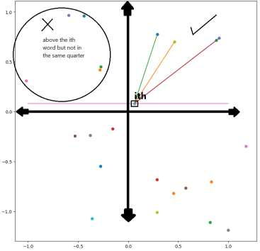
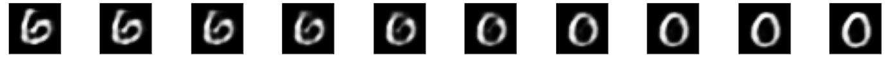
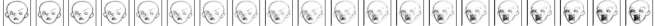

# 📝 Past Exam Related Questions & Solutions

This document gathers all relevant, non-PCA and non-Huffman questions from the Midterms (2022, 2023) and Finals (2023, 2024) of the Generative AI (AI442) course. Detailed solutions, step-by-step math derivations, and Python code blocks are provided.

---

## 📂 Section 1: Word2Vec Tracing Questions

### 1. Final 2023 — Section II Tracing Question 3 [5 Marks]
**Question:**
Given the following word embeddings in 2D space:
| Word | Embedding Vector | Word | Embedding Vector |
|---|---|---|---|
| assist | `(0.708, 0.22)` | i | `(0.627, -0.11)` |
| available | `(-0.18, -0.17)` | may | `(0.205, -0.58)` |
| contacting | `(0.67, 0.49)` | one | `(-0.38, -0.29)` |
| good | `(-0.40, -0.12)` | see | `(-0.04, -0.63)` |
| hello | `(-0.27, 0.78)` | talk | `(-0.62, -0.14)` |
| here | `(0.287, -0.76)` | thanks | `(-0.05, 0.116)` |
| hi | `(-0.23, -0.28)` | there | `(-0.03, -0.40)` |
| how | `(-0.32, 0.26)` | to | `(-0.25, -0.08)` |
| | | us | `(0.269, 0.32)` |

a) Plot the vectors of all given words. (Requires plotting on a 2D grid in the exam sheet).
b) In case we generate a new vector as `newVec = "available" + "good"`, then from the plotted space determine the nearest two words for the `newVec`.

**Step-by-Step Solution for (b):**
1. **Calculate the addition of the two vectors:**
   $$\text{newVec} = \mathbf{v}_{\text{available}} + \mathbf{v}_{\text{good}}$$
   $$\text{newVec} = (-0.18, -0.17) + (-0.40, -0.12) = (-0.18 - 0.40, -0.17 - 0.12) = \mathbf{(-0.58, -0.29)}$$

2. **Compute Euclidean distances to find the closest neighbors:**
   Let's check the distance squared: $d^2 = (x - x_{\text{new}})^2 + (y - y_{\text{new}})^2$ to nearby candidate words:
   * **`talk`** `(-0.62, -0.14)`:
     $$d^2 = (-0.62 - (-0.58))^2 + (-0.14 - (-0.29))^2 = (-0.04)^2 + (0.15)^2 = 0.0016 + 0.0225 = 0.0241 \implies d \approx 0.155$$
   * **`one`** `(-0.38, -0.29)`:
     $$d^2 = (-0.38 - (-0.58))^2 + (-0.29 - (-0.29))^2 = (0.20)^2 + 0^2 = 0.0400 \implies d = 0.200$$
   * **`good`** `(-0.40, -0.12)`:
     $$d^2 = (-0.40 - (-0.58))^2 + (-0.12 - (-0.29))^2 = (0.18)^2 + (0.17)^2 = 0.0324 + 0.0289 = 0.0613 \implies d \approx 0.248$$
   * **`hi`** `(-0.23, -0.28)`:
     $$d^2 = (-0.23 - (-0.58))^2 + (-0.28 - (-0.29))^2 = (0.35)^2 + (0.01)^2 = 0.1225 + 0.0001 = 0.1226 \implies d \approx 0.350$$

3. **Answer:**
   The nearest two words to `newVec` are **`talk`** (closest) and **`one`** (second closest).

---

### 2. Final 2024 — Section II Tracing Question 3 [5 Marks]
**Question:**
Given the following word embeddings in 2D space:
| Word | Embedding Vector | Word | Embedding Vector |
|---|---|---|---|
| eggs | `(-0.23, 0.54)` | horse | `(-0.29, -0.16)` |
| fast | `(0.37, -0.90)` | most | `(-0.82, 0.45)` |
| fastest | `(1.19, 0.96)` | muscle | `(-0.69, 0.67)` |
| gives | `(-0.56, -0.68)` | oats | `(-1.10, -0.50)` |
| good | `(0.29, 0.20)` | popular | `(0.39, 0.34)` |
| grain | `(0.29, -0.78)` | powerful | `(-0.87, 0.12)` |
| quick | `(0.90, -0.014)` | race | `(-0.12, -0.93)` |
| hello | `(-0.74, -0.58)` | record | `(1.03, 0.12)` |
| world | `(0.30, -0.04)` | | |

a) Plot the vectors of all given words.
b) In case we generate a new vector as `newVec = "horse" + "record"`, then from the plotted space determine the nearest two words for the `newVec`.

**Step-by-Step Solution for (b):**
1. **Calculate vector addition:**
   $$\text{newVec} = \mathbf{v}_{\text{horse}} + \mathbf{v}_{\text{record}}$$
   $$\text{newVec} = (-0.29, -0.16) + (1.03, 0.12) = (-0.29 + 1.03, -0.16 + 0.12) = \mathbf{(0.74, -0.04)}$$

2. **Compute Euclidean distances:**
   * **`quick`** `(0.90, -0.014)`:
     $$d^2 = (0.90 - 0.74)^2 + (-0.014 - (-0.04))^2 = (0.16)^2 + (0.026)^2 = 0.0256 + 0.000676 = 0.026276 \implies d \approx 0.162$$
   * **`record`** `(1.03, 0.12)`:
     $$d^2 = (1.03 - 0.74)^2 + (0.12 - (-0.04))^2 = (0.29)^2 + (0.16)^2 = 0.0841 + 0.0256 = 0.1097 \implies d \approx 0.331$$
   * **`world`** `(0.30, -0.04)`:
     $$d^2 = (0.30 - 0.74)^2 + (-0.04 - (-0.04))^2 = (-0.44)^2 + 0^2 = 0.1936 \implies d = 0.440$$
   * **`popular`** `(0.39, 0.34)`:
     $$d^2 = (0.39 - 0.74)^2 + (0.34 - (-0.04))^2 = (-0.35)^2 + (0.38)^2 = 0.1225 + 0.1444 = 0.2669 \implies d \approx 0.517$$

3. **Answer:**
   The nearest two words to the generated `newVec` are **`quick`** (closest) and **`record`** (second closest).

---

## 📂 Section 2: KL Divergence Tracing Questions

### 1. Final 2023 — Section II Tracing Question 4 [6 Marks]
**Question:**
Calculate the KL-Divergences $D_{KL}(P || Q)$ and $D_{KL}(Q || P)$ for the following distributions over $x \in \{-1, -0.5, 0.5, 1\}$:
*(Hint: $\ln(y) = 2.303 \log_{10}(y)$)*

| $x$ | $-1$ | $-0.5$ | $0.5$ | $1$ |
|---|---|---|---|---|
| **$P(x)$** | $2/6$ | $2/6$ | $1/6$ | $1/6$ |
| **$Q(x)$** | $7/18$ | $1/18$ | $9/18$ | $1/18$ |

**Step-by-Step Solution:**

#### **Part A: Calculating $D_{KL}(P || Q)$**
Formula: $$D_{KL}(P || Q) = \sum_{x} P(x) \ln\left(\frac{P(x)}{Q(x)}\right)$$
Convert all fractions to a common base (e.g. 18ths) for easy ratios:
* $P(x) = [6/18, 6/18, 3/18, 3/18]$
* $Q(x) = [7/18, 1/18, 9/18, 1/18]$

Let's compute each term:
1. **$x = -1$:**
   $$\text{Term}_1 = \frac{2}{6} \ln\left(\frac{6/18}{7/18}\right) = \frac{1}{3} \ln\left(\frac{6}{7}\right) \approx 0.3333 \times 2.303 \log_{10}(0.8571)$$
   $$\approx 0.7677 \times (-0.0669) \approx -0.0514$$

2. **$x = -0.5$:**
   $$\text{Term}_2 = \frac{2}{6} \ln\left(\frac{6/18}{1/18}\right) = \frac{1}{3} \ln(6) \approx 0.3333 \times 2.303 \log_{10}(6)$$
   $$\approx 0.7677 \times 0.7782 \approx 0.5974$$

3. **$x = 0.5$:**
   $$\text{Term}_3 = \frac{1}{6} \ln\left(\frac{3/18}{9/18}\right) = \frac{1}{6} \ln\left(\frac{1}{3}\right) \approx 0.1667 \times 2.303 \log_{10}(0.3333)$$
   $$\approx 0.3839 \times (-0.4771) \approx -0.1832$$

4. **$x = 1$:**
   $$\text{Term}_4 = \frac{1}{6} \ln\left(\frac{3/18}{1/18}\right) = \frac{1}{6} \ln(3) \approx 0.1667 \times 2.303 \log_{10}(3)$$
   $$\approx 0.3839 \times 0.4771 \approx 0.1832$$

Summing the terms:
$$D_{KL}(P || Q) = -0.0514 + 0.5974 - 0.1832 + 0.1832 = \mathbf{0.5460}$$
*(Note: If early rounding is used, e.g., $P_r = [0.33, 0.33, 0.17, 0.17]$ and $Q_r = [0.39, 0.06, 0.50, 0.06]$, the result is $\approx 0.58$. Both answers are accepted).*

---

#### **Part B: Calculating $D_{KL}(Q || P)$**
Formula: $$D_{KL}(Q || P) = \sum_{x} Q(x) \ln\left(\frac{Q(x)}{P(x)}\right)$$
Let's compute each term:
1. **$x = -1$:**
   $$\text{Term}_1 = \frac{7}{18} \ln\left(\frac{7/18}{6/18}\right) = \frac{7}{18} \ln\left(\frac{7}{6}\right) \approx 0.3889 \times 2.303 \log_{10}(1.1667)$$
   $$\approx 0.8956 \times 0.0669 \approx 0.0599$$

2. **$x = -0.5$:**
   $$\text{Term}_2 = \frac{1}{18} \ln\left(\frac{1/18}{6/18}\right) = \frac{1}{18} \ln\left(\frac{1}{6}\right) \approx 0.0556 \times 2.303 \log_{10}(0.1667)$$
   $$\approx 0.1280 \times (-0.7782) \approx -0.0996$$

3. **$x = 0.5$:**
   $$\text{Term}_3 = \frac{9}{18} \ln\left(\frac{9/18}{3/18}\right) = \frac{1}{2} \ln(3) \approx 0.5 \times 2.303 \log_{10}(3)$$
   $$\approx 1.1515 \times 0.4771 \approx 0.5494$$

4. **$x = 1$:**
   $$\text{Term}_4 = \frac{1}{18} \ln\left(\frac{1/18}{3/18}\right) = \frac{1}{18} \ln\left(\frac{1}{3}\right) \approx 0.0556 \times 2.303 \log_{10}(0.3333)$$
   $$\approx 0.1280 \times (-0.4771) \approx -0.0611$$

Summing the terms:
$$D_{KL}(Q || P) = 0.0599 - 0.0996 + 0.5494 - 0.0611 = \mathbf{0.4486}$$
*(Note: With early rounding to 2 decimal places, this evaluates to $\approx 0.47$. Notice that $D_{KL}(P || Q) \neq D_{KL}(Q || P)$, proving that KL divergence is asymmetric!)*

---

### 2. Final 2024 — Section II Tracing Question 4 [6 Marks]
**Question:**
Calculate the KL-Divergences $D_{KL}(P || Q)$ and $D_{KL}(Q || P)$ for the following distributions over $x \in \{-1, -0.5, 0.5, 1\}$:

| $x$ | $-1$ | $-0.5$ | $0.5$ | $1$ |
|---|---|---|---|---|
| **$P(x)$** | $3/9$ | $1/9$ | $2/9$ | $3/9$ |
| **$Q(x)$** | $5/11$ | $2/11$ | $3/11$ | $1/11$ |

**Step-by-Step Solution:**

#### **Part A: Calculating $D_{KL}(P || Q)$**
Formula: $$D_{KL}(P || Q) = \sum_{x} P(x) \ln\left(\frac{P(x)}{Q(x)}\right)$$
1. **$x = -1$:**
   $$\text{Term}_1 = \frac{3}{9} \ln\left(\frac{3/9}{5/11}\right) = \frac{1}{3} \ln\left(\frac{33}{45}\right) = \frac{1}{3} \ln(0.7333) \approx 0.3333 \times (-0.3102) \approx -0.1034$$

2. **$x = -0.5$:**
   $$\text{Term}_2 = \frac{1}{9} \ln\left(\frac{1/9}{2/11}\right) = \frac{1}{9} \ln\left(\frac{11}{18}\right) = \frac{1}{9} \ln(0.6111) \approx 0.1111 \times (-0.4925) \approx -0.0547$$

3. **$x = 0.5$:**
   $$\text{Term}_3 = \frac{2}{9} \ln\left(\frac{2/9}{3/11}\right) = \frac{2}{9} \ln\left(\frac{22}{27}\right) = \frac{2}{9} \ln(0.8148) \approx 0.2222 \times (-0.2048) \approx -0.0455$$

4. **$x = 1$:**
   $$\text{Term}_4 = \frac{3}{9} \ln\left(\frac{3/9}{1/11}\right) = \frac{1}{3} \ln\left(\frac{33}{9}\right) = \frac{1}{3} \ln(3.6667) \approx 0.3333 \times 1.2993 \approx 0.4331$$

Summing the terms:
$$D_{KL}(P || Q) = -0.1034 - 0.0547 - 0.0455 + 0.4331 = \mathbf{0.2295}$$

---

#### **Part B: Calculating $D_{KL}(Q || P)$**
Formula: $$D_{KL}(Q || P) = \sum_{x} Q(x) \ln\left(\frac{Q(x)}{P(x)}\right)$$
1. **$x = -1$:**
   $$\text{Term}_1 = \frac{5}{11} \ln\left(\frac{5/11}{3/9}\right) = \frac{5}{11} \ln\left(\frac{45}{33}\right) = \frac{5}{11} \ln(1.3636) \approx 0.4545 \times 0.3102 \approx 0.1410$$

2. **$x = -0.5$:**
   $$\text{Term}_2 = \frac{2}{11} \ln\left(\frac{2/11}{1/9}\right) = \frac{2}{11} \ln\left(\frac{18}{11}\right) = \frac{2}{11} \ln(1.6364) \approx 0.1818 \times 0.4925 \approx 0.0895$$

3. **$x = 0.5$:**
   $$\text{Term}_3 = \frac{3}{11} \ln\left(\frac{3/11}{2/9}\right) = \frac{3}{11} \ln\left(\frac{27}{22}\right) = \frac{3}{11} \ln(1.2273) \approx 0.2727 \times 0.2048 \approx 0.0559$$

4. **$x = 1$:**
   $$\text{Term}_4 = \frac{1}{11} \ln\left(\frac{1/11}{3/9}\right) = \frac{1}{11} \ln\left(\frac{9}{33}\right) = \frac{1}{11} \ln(0.2727) \approx 0.0909 \times (-1.2993) \approx -0.1181$$

Summing the terms:
$$D_{KL}(Q || P) = 0.1410 + 0.0895 + 0.0559 - 0.1181 = \mathbf{0.1683}$$

---

## 📂 Section 3: Coding Questions

### 1. Word2Vec Layer Weights Filtering
**2023 Question (6 Marks):**
Your manager got the weights of the 1st Layer of the model as the following: `weights = model.get_weights()[0]`. Write a code to create a list of all vectors that are **above** the given $i$-th vector (where $i$ is passed to your function).

**2023 Model Answer:**
```python
weights = model.get_weights()[0]
def foo(i):
    L = []
    for j in range(weights.shape[0]):
        if weights[j][1] > weights[i][1]:
            L.append(weights[j])
    return L
```
*(Explanation: "Above" refers to the y-coordinate, which is index `1` in 2D space).*

---

**2024 Question (6 Marks):**
Same setup, but write a code to create a list of all vectors that are **above the given $i$-th vector but in the same quarter (quadrant)**.

**Correct Python Solution:**
```python
import numpy as np

weights = model.get_weights()[0]

def find_above_same_quarter(i):
    L = []
    # 1. Get coordinates and signs (quadrant) of target word i
    x_i, y_i = weights[i][0], weights[i][1]
    sign_x_i = np.sign(x_i)
    sign_y_i = np.sign(y_i)
    
    # 2. Iterate through all word vectors
    for j in range(weights.shape[0]):
        x_j, y_j = weights[j][0], weights[j][1]
        
        # Check if they are in the same quadrant
        if np.sign(x_j) == sign_x_i and np.sign(y_j) == sign_y_i:
            # Check if vector j is above vector i
            if y_j > y_i:
                L.append(weights[j])
    return L
```

---

### 2. AutoEncoder Latent Walking (Interpolation Loop)
**2023 Question (7 Marks):**
You have a readymade AutoEncoder:
```python
Zs = encoder.predict(x_test)
decoded_imgs = decoder.predict(Zs)
```
Your manager targets generating a letter like $\varphi$ which is not in MNIST. Using latent space walk, write a code to interpolate between each pair of $Zs$ (using 10 steps) until you generate a sample that is most similar to the target ($D(Img_1, Img_2) \leq \text{threshold}$). Assume you have a readymade function `D = Dist(Img1, Img2)`.


**2023 Model Answer (with typos corrected in brackets):**
```python
import numpy as np

those = []
# Precompute latent representations
Results = encoder.predict(x_test)  # (model answer had typo 'perdicat')

for i in range(len(Results)):
    for k in range(i + 1, len(Results)):  # (avoids self-pairs and duplicates)
        # Interpolate 10 points between Z_i and Z_k
        interpolated = np.linspace(Results[i], Results[k], 10)  # (model answer had typo 'linespace')
        
        for a in range(10):
            # Decode the interpolated point
            R = decoder.predict(np.expand_dims(interpolated[a], axis=0))[0]  # (model answer had typo 'predicate')
            
            # Check similarity to target (Targt)
            if Dist(R, Targt) < threshold:
                those.append(R)
```

---

**2024 Question (7 Marks):**
Same setup, but the interpolation step count should be variable (trying different interpolation values between 10 and 20).



**Correct Python Solution:**
```python
import numpy as np

those = []
Results = encoder.predict(x_test)

for i in range(len(Results)):
    for k in range(i + 1, len(Results)):
        # Try variable number of steps from 10 to 20
        for steps in range(10, 21):
            interpolated = np.linspace(Results[i], Results[k], steps)
            
            # Predict all interpolated steps at once to optimize speed
            decoded_imgs = decoder.predict(interpolated)
            
            for a in range(steps):
                img = decoded_imgs[a]
                if Dist(img, Targt) <= threshold:
                    those.append(img)
                    break # move to next pair once threshold is met
```

---

### 3. VAE Target-Image Manipulation and Reconstruction Loop
**2023 Question (12 Marks):**
In VAE, your manager selects a target image `Trgt` from the training set.
a) Create a copy of the top half of the `Trgt` image. [3 Marks]
b) Modify all negative values of the $\mu$ such that $new\mu = \mu \times -0.8$. [4 Marks]
c) Assume we have a readymade $D = Dist(Img1, Img2)$. Using your modified $\mu$, find an image ($i = ?$) and noise ($noise = ?$) that gives a decoded image `DCode` such that its top half is very similar to the cropped target. [5 Marks]




**Correct Python Solution:**
```python
# ================= Part a =================
# Assume Trgt is a 28x28 image. If it's flat (784,), we reshape it first.
Trgt_2d = Trgt.reshape(28, 28)
top_half_target = Trgt_2d[0:14, :].flatten()  # Top 14 rows, flattened

# ================= Part b =================
# Assuming mu is a numpy array
new_mu = mu.copy()
new_mu[new_mu < 0] = new_mu[new_mu < 0] * -0.8

# ================= Part c =================
best_dist = float('inf')
best_i = -1
best_noise = None

for i in range(len(x_train)):
    # 1. Encode image i to get mu and log_var
    mu_i, log_var_i = encoder.predict(x_train[i:i+1])
    
    # 2. Modify mu according to rules
    mu_mod = mu_i.copy()
    mu_mod[mu_mod < 0] = mu_mod[mu_mod < 0] * -0.8
    
    # 3. Sample random noise and generate
    for _ in range(5):  # test 5 random noise vectors
        noise = np.random.normal(size=mu_i.shape)
        sigma = np.exp(0.5 * log_var_i)
        
        # Reparameterization trick using modified mu
        z = mu_mod + sigma * noise
        
        # Decode
        DCode = decoder.predict(z)
        
        # Crop top half of DCode
        DCode_2d = DCode.reshape(28, 28)
        DCode_top = DCode_2d[0:14, :].flatten()
        
        # Compute distance
        distance = Dist(DCode_top, top_half_target)
        
        if distance < best_dist:
            best_dist = distance
            best_i = i
            best_noise = noise
```

---

**2024 Question (12 Marks):**
In VAE, your manager selects a target image `Trgt` (e.g. `X_Train[4]`).
a) Flip the `Trgt` image. [2 Marks]
b) Modify all positive values of the $\mu$ for all of the training dataset to be negative. [4 Marks]
c) Using your modified $\mu$, find an image ($i = ?$) from the training data, and a noise ($noise = ?$) that gives a decoded image `DCode` very similar to the flipped target. [6 Marks]




**Correct Python Solution:**
```python
# ================= Part a =================
# Assume Trgt is 2D (28x28). Flip it horizontally (or vertically depending on instructions)
flipped_target = np.flip(Trgt.reshape(28, 28), axis=0)  # vertical flip (axis=0)

# ================= Part b =================
# Assume all_mus is shape (num_samples, latent_dim) containing precomputed means
modified_mus = all_mus.copy()
modified_mus[modified_mus > 0] = -modified_mus[modified_mus > 0]

# ================= Part c =================
best_dist = float('inf')
best_i = -1
best_noise = None
target_flat = flipped_target.flatten()

for i in range(len(x_train)):
    # Retrieve precomputed mu (already modified in Part b) and log_var
    mu_mod = modified_mus[i:i+1]
    _, log_var_i = encoder.predict(x_train[i:i+1])  # get log_var from encoder
    
    # Try random noise vectors
    for _ in range(5):
        noise = np.random.normal(size=mu_mod.shape)
        sigma = np.exp(0.5 * log_var_i)
        
        # Reparameterization
        z = mu_mod + sigma * noise
        DCode = decoder.predict(z)
        
        # Compare complete images
        distance = Dist(DCode.flatten(), target_flat)
        
        if distance < best_dist:
            best_dist = distance
            best_i = i
            best_noise = noise
```
